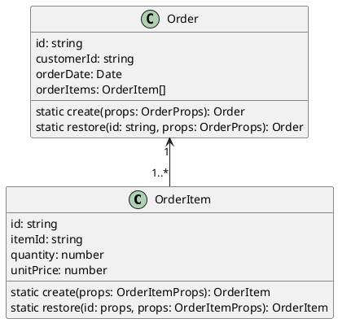
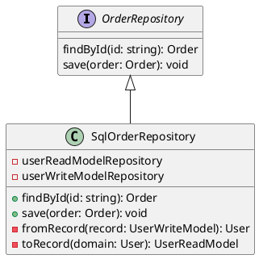
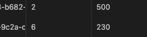

# CQS

コマンド・クエリ分離の原則(CQS)は、副作用を最小限に抑えるための設計原則です。[楽水 ソフトウェアの設計原則②コマンド・クエリ分離の原則（CQS）](https://rakusui.org/cqs/)
副作用を最小限に抑えることで、保守性と再利用性を高めるための設計原則です。
プログラミングにおける副作用とは、Wikipediaによると、関数から結果を受け取ることが主たる作用であり、それ以外のコンピュータの論理的状態(ローカル環境以外の状態変数の値)を変更させる作用を副作用と言います。

CQSではオブジェクトの状態を変更させるメソッドをコマンドと呼び、コマンドは値を返してはなりません。メソッドが何らかの値を戻すのであれば、そのメソッドはクエリであり、オブジェクトの状態を変更してはなりません。

最終的には読み込み用データストアと書き込み用のデータストアを分けるCQRSのアーキテクチャパターンに昇華されます。
データ書き込み時と読み込み時にSQL関数を特定のカラムに適用して書き込んだり読み込んだりする要件があります。
使用しているORMはTypeORMを使用しています。
Entityを保存するときにSQL関数を適用するのにクエリビルダーを使うことで実現可能であるという情報を得ました。

```ts
await getRepository(User).createQueryBuilder()
    .insert()
    .into(User)
    .values({
        name: 'John',
        createdAt: () => "NOW()",  // SQL関数を使用
    })
    .execute();
```

Entityを取得するときにSQL関数を適用した結果はEntityではなく生のレコードしか取得できません。

```ts
const users = await getRepository(User)
    .createQueryBuilder('user')
    .select([
        'user.id',
        'user.name',
        "TO_CHAR(user.createdAt, 'YYYY-MM-DD') as formattedDate" // SQL関数を適用
    ])
    .getRawMany();
```

TypeORMはSQL関数を直接エンティティにマッピングできるAPIを持たないため、カスタムSQLをそのままマッピングに使用するには一度生データを取得し、それを手動でエンティティにマッピングする必要があります。ただし、以下の方法でSQL関数の適用結果をエンティティに近い形で取得することは可能です。

```ts
import { ViewEntity, ViewColumn } from 'typeorm';

@ViewEntity({
  expression: `
    SELECT
      id,
      name,
      TO_CHAR(createdAt, 'YYYY-MM-DD') as formattedDate
    FROM user
  `
})
export class UserView {
  @ViewColumn()
  id: number;

  @ViewColumn()
  name: string;

  @ViewColumn()
  formattedDate: string;
}
```

ドメインのエンティティに詰め替えるのであれば、TypeORMのEntityである必要はなく、生のレコードで構いません。

このように読み込みと書き込みでデータベースのエンティティが異なりますので、CQSをイメージしました。

画面に表示する一覧はViewEntityを使用し、ドメインエンティティを組み立てるためのクエリは生レコードを取得して、ドメインリポジトリの中でドメインエンティティに組み立てることを考えました。

NestJS v10を使用しています。

ドメイン用のリポジトリ。
ドメインの読み書きを行います。イベントソーシングとCQRSを組み合わせる場合は、コマンド側のイベントストアとクエリ側のリードモデルは異なるデータソースを使用しなくてはならないため、`userWriteModelRepository`と`userReadModelRepository`のデータソースは異なります。

```ts
@Injectable()
export class SqlUserRepository implements UserRepository {
  constructor(
    @InjectRepository(UserTable)
    private userWriteModelRepository: Repository<UserTable>,
    @InjectRepository(UserView)
    private userReadModelRepository: Repository<UserView>,
  ) {}

  async findById(id: UserId): Promise<User | null> {
    const record = await this.userReadModelRepository
      .createQueryBuilder('user')
      .select([
        'user.id',
        'user.name',
        "TO_CHAR(user.createdAt, 'YYYY-MM-DD') AS createdAt",
      ])
      .where('user.id = :id', { id: id.value })
      .getRawMany();
    return record != null ? this.fromRecord(record) : null;
  }

  async save(domain: User): Promise<void> {
    const record = this.toRecord(domain);
    await this.userWriteModelRepository.save(record);
  }

private fromRecord(record: UserView): User {
    // UserViewからUserへ変換する。
  }

  private toRecord(domain: User): UserTable {
    // UserからUserTableへ変換する。
  }
}
```

ドメイン層のリポジトリでデータソースのエンティティを取得するのは、ドメイン層のビジネスルールや制約を解決するためのメソッドのみを定義します。
例えば、ドメインでは重複登録を抑止する必要がある場合、コードによる重複検証を行うために、`findByCode`のメソッドをドメインリポジトリに定義するのはアリです。

画面一覧などで使用するリポジトリはクエリサービスと名付けてドメインのリポジトリとは分けて管理をします。

```ts
@Injectable()
export class SqlUserQueryService implements UserQueryService {
  constructor(@InjectRepository(UserView) userRepository: Repository<UserView>) {}

  async find(condition: UserSearchCondition): Promise<ReadonlyArray<UserView>> {
    // conditionよりリポジトリ用の検索条件を組み立てる。
    return await this.userRepository.find(this.toRepositoryCondition(condition));
  }
}
```

`UserQueryService`インターフェイスはアプリケーション層に定義し、`SqlUserQueryService`はインフラストラクチャ層に定義します。

この考え方で実装ができるかコードを書いて検証を行います。

前提条件

- Node.JS v20
- Nest CLI
- PostgreSQL 16

TypeORMのバージョンは0.3で検証します。パッケージマネージャはyarnを使用します。

```shell
nest new order-service
cd order-service
yarn add @nestjs/typeorm typeorm pg uuid
yarn add -D @types/uuid
```

## save

注文集約があり、その注文を保存して、注文IDで注文を取得するコードを記述します。
簡便化するために、値オブジェクトは使用せず、ドメインのエンティティは単純なクラスとして定義します。





注文ドメインのコードを記述します。本来は値オブジェクトにすべきフィールドがありますが、簡便的にプリミティブ変数を使用しています。

./order/domain/order-item.ts

```ts
export type OrderItemProps = {
  itemId: string;
  quantity: number;
  unitPrice: number;
};

export class OrderItem {
  constructor(private _id: string, private props: OrderItemProps) {}

  get id(): string {
    return this._id
  }

  get itemId(): string {
    return this.props.itemId;
  }

  get quantity(): number {
    return this.props.quantity;
  }

  get unitPrice(): number {
    return this.props.unitPrice;
  }

  static create(props: OrderItemProps): OrderItem {
    const id = uuidv4();
    return new OrderItem(id, props);
  }

  static restore(id: string, props: OrderItemProps): OrderItem {
    return new OrderItem(id, props);
  }
}
```

./order/domain/order.ts

```ts
export type OrderProps = {
  customerId: string;
  orderDate: Date;
  orderItems: OrderItem[];
};

export type CreateOrderProps = {
  customerId: string;
  orderItems: OrderItem[];
};

export class Order {
  constructor(private _id: string, private props: OrderProps) {}

  get id(): string {
    return this._id;
  }

  get customerId(): string {
    return this.props.customerId;
  }

  get orderDate(): Date {
    return this.props.orderDate;
  }

  get orderItems(): OrderItem[] {
    return this.props.orderItems;
  }

  static create(createProps: CreateOrderProps): Order {
    const id = uuidv4();
    const props = { orderDate: new Date(), ...createProps };
    return new Order(id, props);
  }
}
```

TypeORMのエンティティをデータベースの書き込み時に、Typescriptの関数を適用するのであれば、`@BeforeInsert()`デコレータや`@BeforeUpdate()`デコレータで関数を適用することができます。
[TypeORMのEntity Listeners and SubscribersのWhat is an Entity Listener](https://typeorm.io/listeners-and-subscribers#what-is-an-entity-listener)
SQL関数を適用したい場合はこれらのデコレータでは対応できません。
`OrderItem.quantity`をデータベースへ登録する時にSQL関数の`ADD_ONE()`を適用できるか検証してみます。
つまり、`OrderItem`を登録するときに、以下のSQLが実行できればOKです。

```sql
INSERT INTO ORDER_ITEM (ID, ITEM_ID, QUANTITY, UNIT_PRICE) VALUES('AAA', 'BBB', ADD_ONE(5), 235);
```

PostgreSQLに以下の関数を作成します。

```sql
CREATE OR REPLACE FUNCTION ADD_ONE(INTEGER)
RETURNS INTEGER AS $$
  SELECT $1 + 1;
$$ LANGUAGE sql;
```

TypeORMでは直接SQL関数を実行する機能は用意していませんが、クエリビルダーを使用することで実現が可能です。

注文と注文明細の書き込み用のエンティティを用意します。

./order/infrastructure/order.write-model.ts

```ts
@Entity({ name: 'ORDER', comment: '注文' })
export class OrderWriteModel {
  @PrimaryColumn({ name: 'ID', comment: '注文ID' })
  id!: string;

  @Column({ name: 'CUSTOMER_ID', comment: '顧客ID' })
  customerId!: string;

  @Column({ name: 'ORDER_DATE', comment: '注文日' })
  orderDate!: Date;
}
```

./order/infrastructure/order-item.write-model.ts

```ts
@Entity({ name: 'ORDER_ITEM', comment: '注文明細' })
export class OrderItemWriteModel {
  @PrimaryColumn({ name: 'ID', comment: '注文明細ID' })
  id!: string;

  @Column({ name: 'ITEM_ID', comment: '品目ID' })
  itemId!: string;

  @Column({ name: 'QUANTITY', comment: '数量' })
  quantity!: number;

  @Column({ name: 'UNIT_PRICE', comment: '単価' })
  unitPrice!: number;
}
```

注文が主テーブルで、注文明細が従属テーブル。注文が1で注文明細が多の設定を行います。

./order/infrastructure/order.write-model.ts

```ts
export class OrderWriteModel {
  // ...
  @OneToMany(() => OrderItemWriteModel, (orderItem) => orderItem.order, { cascade: true })
  orderItems!: OrderItemWriteModel[];
}
```

./order/infrastructure/order-item.write-model.ts

```ts
export class OrderItemWriteModel {
  // ...
  @ManyToOne(() => OrderWriteModel, (order) => order.orderItems, { nullable: false })
  order!: Order;
}
```

`OrderRepository`インターフェイスを実装した`SqlOrderRepository`クラスを実装します。

./order/infrastructure/sql-order.repository.ts

```ts
@Injectable()
export class SqlOrderRepository implements OrderRepository {
  constructor(
    @InjectRepositorry(OrderWriteModel)
    private readonly orderWwriteModelRepository: Repository<OrderWriteModel>
  ) {}

  findById(id: string): Promise<Order | null> {
    throw new Error('Method not Implemented');
  }

  save(domain: Order): Promise<void> {
    throw new Error('Method not Implemented');
  })
}
```

ドメインの注文集約を注文ライトモデルに変換するメソッド`toRecord()`を作成します。

```ts
export class SqlOrderRepository implements OrderRepository {
  // ...
  private toRecord(domain: Order): OrderWriteModel {
    const record = new OrderWriteModel();
    record.id = domain.id;
    record.customerId = domain.customerId;
    record.orderDate = domain.orderDate;
    record.orderItems = domain.orderItems.map((orderItem) => {
      const record = new OrderItemWriteModel();
      record.id = orderItem.id;
      record.itemId = orderItem.itemId;
      record.quantity = orderItem.quantity;
      record.unitPrice = orderItem.unitPrice;
      return record;
    });
    return record;
  }
}
```

`save`メソッドを実装します。
TypeORMのRepositoryインターフェイスからクエリビルダーを作成し、データベースに挿入するコードを記述します。

```ts
export class SqlOrderRepository implements OrderRepository {
  // ...
  async save(order: Order): Promise<void> {
    const record = this.toRecord(order);
    const {orderItems, ...rest} = record;
    const updatedOrder = {...rest, orderItems: orderItems.map((orderItem) => {
      const {quantity, ...rest} = orderItem;
      return {...rest, quantity: `ADD_ONE(${orderItem.quantity})`};
    })};
    await this.orderWriteModelRepository.createQueryBuilder()
      .insert()
      .into(OrderWriteModel)
      .values(updatedOrder),
      .execute();
  }
}
```

`toRecord`関数で一旦レコードに変換した後、クエリビルダーで生成したSQL文にSQL関数を適用したカラムを挿入します。
そのためにスプレッド構文で置き換え対象の`orderItems`を切り離します。切り離した残りは`rest`という変数です。

```ts
    const {orderItems, ...rest} = record;
```

`orderItems`の各要素についても`quantity`を切り離し、残った注文明細に新しく`ADD_ONE` SQL関数を適用した`quantity`を追加して返します。

```ts
      const {quantity, ...rest} = orderItem;
      return {...rest, quantity: `ADD_ONE(${orderItem.quantity})`};
```

最後に`rest`に返ってきた`orderItems`を追加した注文をクエリビルダーの値に追加します。

```ts
    await this.orderWriteModelRepository.createQueryBuilder()
      .insert()
      .into(OrderWriteModel)
      .values(updatedOrder),
      .execute();
```

`Order`のモジュールとコントローラとサービスを作成します。

```shell
nest g module order
nest g controller order
nest g service order
```

./orderにorder.module.ts、order.controller.ts、order.service.tsが生成されます。

`OrderService`のコンストラクタに`OrderRepository`を挿入します。

./order/order.service.ts

```ts
@Injectable()
export class OrderService {
  constructor(@Inject('ORDER_REPOSITORY') private readonly orderRepository: OrderRepository) {}
}
```

`createOrder`メソッドを実装します。
`OrderDto`から`Order`ドメインに変換して注文リポジトリの保存を呼び出します。

```ts
export class OrderService {
  constructor(@Inject('ORDER_REPOSITORY') private readonly orderRepository: OrderRepository) {}

  async createOrder(orderDto: OrderDto): Promise<void> {
    const order = this.toDomain(orderDto);
    await this.orderRepository.save(order);
  }

  private toDomain(orderDto: OrderDto): Order {
    const orderItems = orderDto.orderItems.map((oi) => OrderItem.create(oi));
    const { customerId } = orderDto;
    const props = { customerId, orderItems };
    return Order.create(props);
  }
}
```

`OrderController`コントローラに`@POST()`デコレータの`createOrder`メソッドを実装します。

./order/order.controller.ts

```ts
export class OrderItemDto {
  itemId: string;
  quantity: number;
  unitPrice: number;
}

export class OrderDto {
  customerId: string;
  orderItems: OrderItemDto[];
}

@Controller('order')
export class OrderController {
  constructor(private readonly orderService: OrderService) {}

  @Post()
  async createOrder(@Body() order: OrderDto) {
    await this.orderService.createOrder(order);
  }
}
```

これらのオブジェクトをモジュールに登録します。

./order/order.module.ts

```ts
@Module({
  imports: [TypeOrmModule.forFeature([OrderWriteModel, OrderItemWriteModel])],
  providers: [OrderService,
    {
      provide: 'ORDER_REPOSITORY',
      useClass: SqlOrderRepository,
    }
  ],
  controllers: [OrderController],
})
export class OrderModule {}
```

データベースの設定を`app.module.ts`に設定します。

./app.module.ts

```ts
@Module({
  imports: [OrderModule,
    TypeOrmModule.forRoot({
      type: 'postgres',
      host: 'localhost',
      port: 5432,
      username: 'postgres',
      password: 'postgres',
      database: 'cqs',
      entities: [OrderWriteModel, OrderItemWriteModel],
      synchronize: false,
      logging: false,
    }),
  ],
  controllers: [AppController],
  providers: [AppService],
})
export class AppModule {}
```

環境を作りやすいことから今回はPostgreSQLを用意しました。

データベース設定とエンティティの設定からデータベースとそのデータベースに`ORDER`と`ORDER_ITEM`テーブルを作成します。
`TypeOrmModule.forRoot`のパラメータ`synchronize`を`true`にしてサーバーを起動することによりTypeORMのエンティティに記述してある内容に従ってテーブルが作成されます。危険ですので運用環境では`true`にしないでください。

それでdはサーバーを起動します。

```shell
yarn start:dev
```

curlで`Order`にPOSTを発行します。

```shell
curl -X POST -H "Content-Type: application/json" \
-d '{"customerId": "2e1a7be-7a7f-4374-981d-71e2d1517198", "orderItems": [{"itemId": "3eb73463-d92d-4193-b682-1a0c9547716f", "quantity": 1, "unitPrice": 500}, {"itemId": "d87d0eaa-75fc-4364-9c2a-cbf406d986d1", "quantity": 5, "unitPrice": 230}]}' \
http://localhost:3000/order
```

ORDERへはレコードが登録されましたが、ORDER_ITEMにはレコードが登録されていません。
調べたところ、クエリビルダーでは別のテーブルに同時にレコードを追加することはできません。
トランザクションを作成してORDERとORDER_ITEMそれぞれにレコードを挿入するか、TypeORMの`Repository`の`save`メソッドを使用する必要があります。`Repository`の`save`では保存時にSQL関数を実行できないため、トランザクションを発行して`ORDER`と`ORDER_ITEM`それぞれにレコードを挿入する必要があります。
主テーブルと従属テーブルである設定は削除し、`OrderItemWriteModel`に`orderItem`を追加します。

./order/infrastructure/order.write-model.ts

```ts
export class OrderWriteModel {
  // ...
  // @OneToMany(() => OrderItemWriteModel, (orderItem) => orderItem.order, { cascade: true })
  // orderItems!: OrderItemWriteModel[];
}
```

./order/infrastructure/order-item.write-model.ts

```ts
export class OrderItemWriteModel {
  // ...
  // @ManyToOne(() => OrderWriteModel, (order) => order.orderItems, { nullable: false })
  // order!: Order;
  @Column({ name: 'ORDER_ID', comment: '注文ID' })
  orderId!: number;
}
```

./order/infrastructure/sql-order.repository.ts

toRecordで注文と注文明細の配列を分けて配列に入れて返却します。

```ts
  private toRecord(domain: Order): [OrderWriteModel, OrderItemWriteItemModel[]] {
    const order = new OrderWriteModel();
    order.id = domain.id;
    order.customerId = domain.customerId;
    order.orderDate = domain.orderDate;
    const orderItems = domain.orderItems.map((orderItem) => {
      const record = new OrderItemWriteModel();
      record.id = orderItem.id;
      record.itemId = orderItem.itemId;
      record.quantity = orderItem.quantity;
      record.unitPrice = orderItem.unitPrice;
      return record;
    });
    return [order, orderItems];
  }
```

トランザクションを実行し、その中で注文と注文明細を更新します。

```ts
  async save(order: Order): Promise<void> {
    const [orderRecord, orderItemRecords] = this.toRecord(order);
    await this.orderWriteModelRepository.manager.transaction(async (manager) => {
      await manager.createQueryBuilder()
        .insert()
        .into(OrderWriteModel)
        .values(order)
        .execute();

      order.orderItems.forEach(async (orderItem) => {
        const {quantity, ...rest} = orderItem;
        const updatedOrderItem = {
          ...rest,
          orderId: orderRecord.id,
          quantity: this.addOne(orderItem.quantity)
        };
        await manager.createQueryBuilder()
          .insert()
          .into(OrderItemWriteModel)
          .values(updatedOrderItem)
          .execute();
      });
    }
  }
```

で、再度curlをしたところ、`ORDER`、`ORDER_ITEM`ともにレコードが登録されており、`ORDER_ITEM`の`QUANTITY`には指示した値の+1が反映されていました。

```shell
, "quantity": 1, "unitPrice": 500
```

```shell
, "quantity": 5, "unitPrice": 230
```



`ADD_ONE`関数が適用されて数量が2と6で反映されています。

今回はINSERTのみを検証しましたが、UPDATEも同じ方法で対応が可能であると考えられます。

以下の例では`id`が登録されているかで登録か更新を判断しています。

./order/infrastructure/sql-order.repository.ts

```ts
  async save(order: Order): Promise<void> {
    const [orderRecord, orderItemRecords] = this.toRecord(order);
    await this.orderWriteModelRepository.manager.transaction(async (manager) => {
      if (await this.existOrder(orderRecord.id, manager)) {
        await this.updateOrder(orderRecord, manager);
      } else {
        await this.insertOrder(orderRecord, manager);
      }

      orderItemRecords.forEach(async (oi) => {
        if (await this.existOrderItem(oi.id, manager)) {
          await this.updateOrderItem(oi, orderRecord.id, manager);
        } else {
          await this.insertOrderItem(oi, orderRecord.id, manager);
        }
      });
    });
  }
```

次は`OrderItemReadModel`を定義して`OrderRepository`の`findById`でレコードを取得する際にSQL関数を適用する方法について検証します。

## findById

今度は`SqlOrderRepository`の`findById`で注文明細の数量を取得する際にSQLの`REMOVE_ONE`関数を適用できることを検証します。

`REMOVE_ONE`関数は以下のようにしてPostgreSQLに登録します。

```sql
CREATE OR REPLACE FUNCTION REMOVE_ONE(INTEGER)
RETURNS INTEGER AS $$
  SELECT $1 - 1;
$$ LANGUAGE sql;
```

前回は書き込み専用のエンティティを作成しましたが、今回は読み込み専用のエンティティを作成します。
`@Entity({name: 'ORDER'})`とすると、書き込みのエンティティと衝突するので、`@ViewEntity`を使用します。View EntityはデータベースのVIEWにマッピングされるクラスです。データベースにビューを作成してそのビューをマッピングするビューエンティティクラスを作成します。

```sql
CREATE VIEW "VIEW_ORDER" AS
SELECT H."ID" as "H_ID",
H."CUSTOMER_ID" as "H_CUSTOMER_ID",
H."ORDER_DATE" as "H_ORDER_DATE",
D."ID" AS "D_ID",
D."ITEM_ID" AS "D_ITEM_ID",
REMOVE_ONE(D."QUANTITY") AS "D_QUANTITY",
D."UNIT_PRICE" AS "D_UNIT_PRICE"
FROM "ORDER" H
INNER JOIN "ORDER_ITEM" D ON D."ORDER_ID" = H."ID";
```

SQL文に直接`REMOVE_ONE`を適用します。
ViewEntityには主テーブルと従属テーブルでもEntityと違い主テーブルのインスタンスに従属テーブルの配列を持って、その配列に従属テーブルのインスタンスを代入するような機能はないため、主テーブルと従属テーブルのカラムを1インスタンスとするように`ViewEntity`クラスを定義を記述します。

./order/infrastructure/order.read-model.ts

```ts
@ViewEntity({
  name: 'VIEW_ORDER',
  expression: ''
})
export class OrderReadModel {
  @ViewColumn({ name: 'H_ID' })
  id!: string;

  @ViewColumn({ name: 'H_CUSTOMER_ID' })
  customerId!: string;

  @ViewColumn({ name: 'H_ORDER_DATE' })
  orderDate!: Date;

  @ViewColumn({ name: 'D_ID' })
  orderDetailId!: string;

  @ViewColumn({ name: 'D_ITEM_ID' })
  orderDetailItemId!: string;

  @ViewColumn({ name: 'D_QUANTITY' })
  orderDetailQuantity!: number;

  @ViewColumn({ name: 'D_UNIT_PRICE' })
  orderDetailUnitPrice!: number;
}
```

エンティティは`VIEW_ORDER`ビューの構造をそのまま使用するため、`expression`は空文字にします。`expression`は必須項目なので削除はできないためです。

この`ViewEntity`のTypeORMリポジトリを`SqlOrderRepository`のコンストラクタに注入します。

./order/infrastructure/sql-order.repository.ts

```ts
export class SqlOrderRepository implements OrderRepository {
  constructor(
    @InjectRepository(OrderWriteModel)
    private readonly orderWriteModelRepository: Repository<OrderWriteModel>,
    @InjectRepository(OrderReadModel)
    private readonly orderReadModelRepositorry: Repository<OrderReadModel>
  ) {}
}
```

`findById`メソッド内で`orderReadModelRepository`を利用して注文IDからレコードを取得します。

./order/infrastructure/sql-order.repository.ts

```ts
async findById(id: string): Promise<Order | null> {
  const records = await this.orderReadModelRepository.findBy({ id });
  // ...
}
```

検索結果のレコードは注文レコードと注文明細レコードが1つのインスタンスとして取得されます。
検索対象の注文の注文明細が複数ある場合、1注文でも複数行が返ってくるため、`findOneBy`を使用せずに`findBy`を使用します。
そうしないと注文明細が1行だけしか取得できません。

取得したレコードをドメインの注文インスタンスに変換するための`fromRecord`メソッドを作成します。

```ts
private fromRecord(records: OrderReadModel[]): Order | null {
  if (records.length === 0) {
    return null;
  }
  const orderItems = records.map((record) => {
    const id = record.orderDetailId;
    const itemId = record.orderDetailItemId;
    const quantity = record.orderDetailQuantity;
    const unitPrice = record.orderDetailUnitPrice;
    return OrderItem.restore(id, { itemId, quantity, unitPrice });
  });
  const { id, customerId, orderDate } = records[0];
  return Order.restore(id, { customerId, orderDate, orderItems });
}
```

取得したレコードセットから`fromRecord`を経由してドメインモデルに変換します。

```ts
async findById(id: string): Promise<Order | null> {
  const records = await this.orderReadModelRepository.findBy({ id });
  return this.fromRecord(records);
}
```

コントローラが返却するDTOを定義します。

./order/order.controller.ts

```ts
export class OrderItemReadDto {
  id: string;
  itemId: string;
  quantity: number;
  unitPrice: number;
}

export class OrderReadDto {
  id: string;
  customerId: string;
  orderDate: string;
  orderItems: OrderItemReadDto[];
};
```

ドメインモデルからコントローラが返却するモデルに変換するためのメソッドを作成します。

./order/order.service.ts

```ts
export class OrderService {
  // ..
  private fromDomain(domain: Order): OrderReadDto {
    const order = new OrderReadDto();
    order.id = domain.id;
    order.customerId = domain.customerId;
    order.orderDate = domain.orderDate.toLocaleDateString('sv-SE');
    order.orderItems = domain.orderItems.map((orderItem) => {
      const dto = new OrderItemReadDto();
      dto.id = orderItem.id;
      dto.itemId = orderItem.itemId;
      dto.quantity = orderItem.quantity;
      dto.unitPrice = orderItem.unitPrice;
      return dto;
    });
    return order;
  }
}
```

注文サービスに注文IDから注文を取得するメソッドを追加します。

./order/order.service.ts

```ts
export class OrderService {
  // ..
  async findById(id: string): Primise<OrderReadDto | null> {
    const order = await this.orderReapository.findById(id);
    return order != null ? this.fromDomain(order) : null;
  }
}
```

注文コントローラで注文サービスを呼び出す`findById`メソッドを追加します。

./order/order.controller.ts

```ts
export class OrderController {
  @Get(':id')
  async findById(@Param('id') id: string): Promise<OrderReadDto> {
    const order = await this.orderService.findById(id);
    if (order == null) {
      throw new NotFoundException();
    }
    return order;
  }
}
```

作成した`OrderReadModel`をTypeOrmModuleを記述している２箇所に追加します。

./app.module.ts

```ts
    TypeOrmModule.forRoot({
      type: 'postgres',
      host: '172.17.0.2',
      port: 5432,
      username: 'postgres',
      password: 'postgres',
      database: 'cqs',
      entities: [OrderWriteModel, OrderItemWriteModel, OrderReadModel],
      synchronize: false,
      logging: false,
    }),
```

./order/order.module.ts

```ts
  imports: [TypeOrmModule.forFeature([OrderWriteModel, OrderItemWriteModel, OrderReadModel])],
```

GET /order/{id} で注文が取得できます。
注文ID 2c90a80c-53dc-4f42-9d75-4a8be6917584 が注文テーブルに存在していたので、その注文を呼び出してみます。

```shell
curl -X GET http://localhost:3000/order/2c90a80c-53dc-4f42-9d75-4a8be6917584/
{"id":"2c90a80c-53dc-4f42-9d75-4a8be6917584","customerId":"2e1a7be-7a7f-4374-981d-71e2d1517198","orderDate":"2024-10-23","orderItems":[{"id":"0fd6ee15-1899-425b-b0c4-b411793caec8","itemId":"3eb73463-d92d-4193-b682-1a0c9547716f","quantity":1,"unitPrice":500},{"id":"45a2a226-8be1-44ed-9216-ed25a546f4d4","itemId":"d87d0eaa-75fc-4364-9c2a-cbf406d986d1","quantity":5,"unitPrice":230}]}
```

指定した注文が取得できました。
`REMOVE_ONE`関数が適用された数量が取得できました。

## 結論

特定のカラムにSQL関数を適用して保存したり、SQL関数を適用して取得する場合があります。
その様な要件の場合は、読み込みと書き込みでエンティティを分けます。ただしエンティティの属性は一致させる必要があります。エンティティを書き込んでそのエンティティを取得した場合、書き込み時と同じエンティティが復元される必要があります。
読み込みで使用する場合はビジネスルールまたは制約で必要な条件のみ設定する様にします。
例えば重複したエンティティを登録しないためにコードで検索して既に登録されていないかを検証するのであれば、コードで検索するメソッドは定義する必要があります。

それ以外の検索の場合は、クエリサービスを使用して取得します。主にクエリサービスは一覧画面のように集約を超えたエンティティの集まりを検索する場合に作成します。

SQL関数を適用する場合はコード量も増え複雑になるし、関数のビジネスロジックがコードベースにないため、コードベースに記述をし、SQL関数は使わない様にしましょう。
